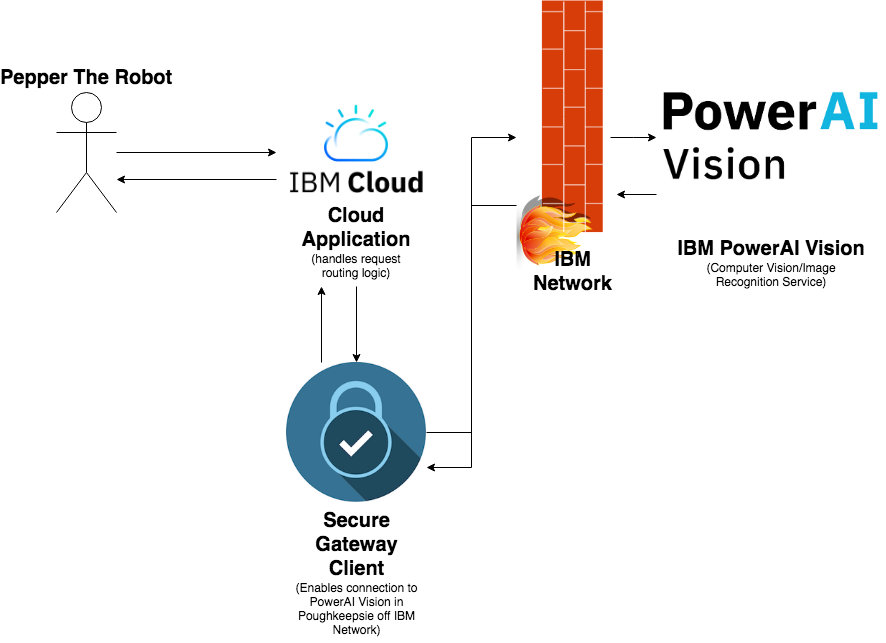
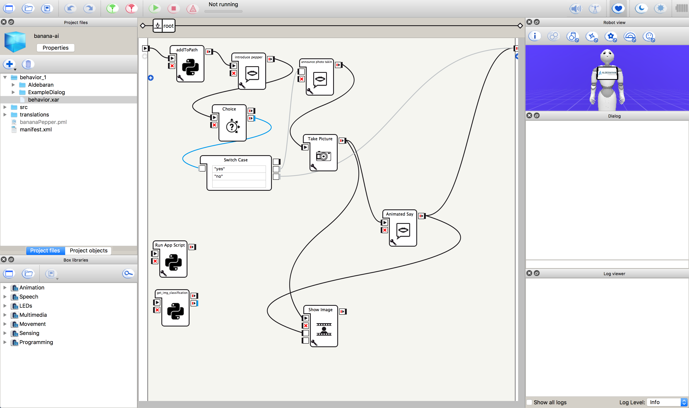
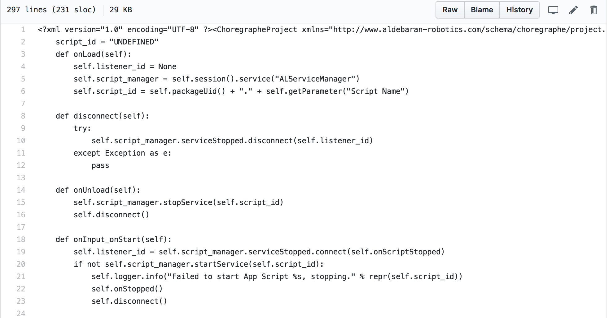
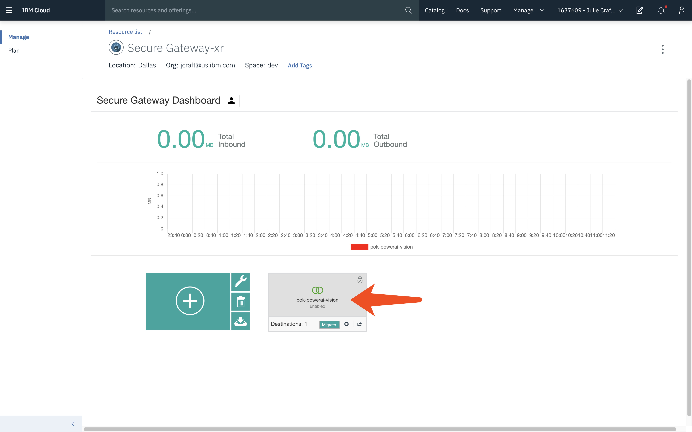
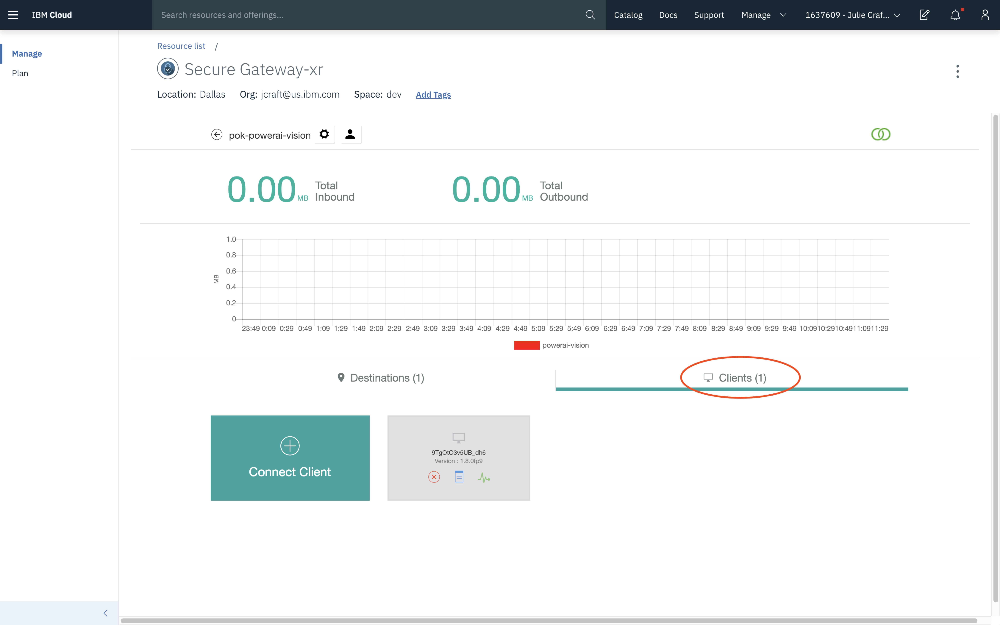
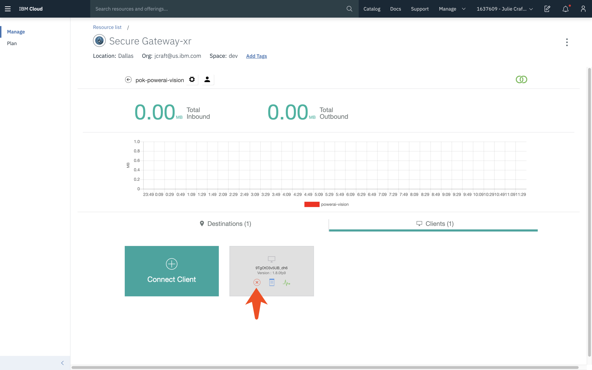
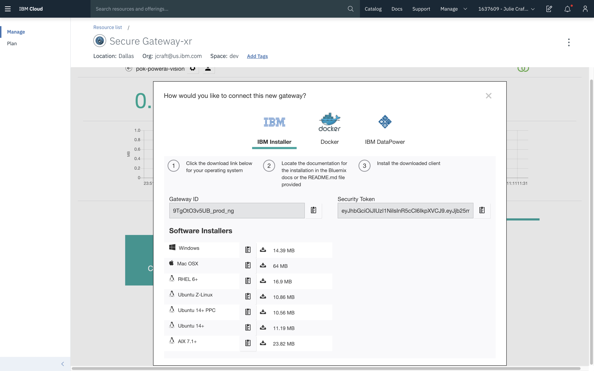
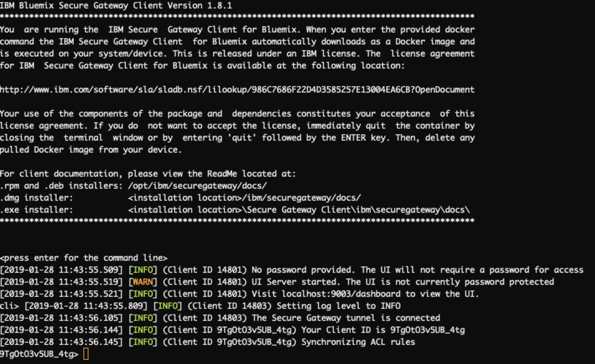
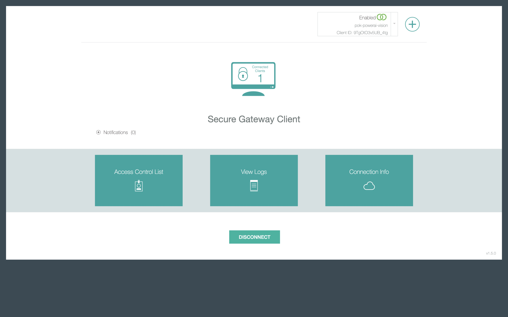

# BananaAI: A Paper To Be Named Later

**Document Authors:** Jonathan Clow, Wenxin Elina Liu, Jun Yu  
**Project Members:** Jonathan Clow, Ian Dominguez, Wenxin Elina Liu, Daniel Ruiz, Jared Ryan, Jun Yu  
**Sponsors:** Julie Craft, Amartey Pearson, Nathan Chaney  
**Design Coach:** Ashley Profozich  

## Summary of Technologies Used

#### User Interface:
- Pepper the Robot, Softbank Robotics
#### Application Layer
- IBMCloud (hosting)
- CloudFoundry (deployment)
- Node.JS (application development)
- GitLab (source control, IBM Cloud)
- GitHub (source control)
- TravisCI (continuous development/integration)
#### Networking
- IBM Secure Gateway
#### Visual Recognition Services
- IBM PowerAI Vision
- IBM Watson Visual Recognition

## Introduction

From October 2018 to February 2019, the members of this team participated in the IBM Developer Jumpstart Program's Technical Challenge. IBM offers this program for new hire college graduates as a means of introducing them to the company, their roles, and other business units and programs that the new hire may not experience through their assigned role and team.

Participants in the technical challenge were assigned to one of several groups based on subject matter interest. Each group worked on a different business problem that was determined by an internal Sponsor. The technical challenge (in the iteration that we participated in) consisted of one month of working on IBM Design Thinking deliverables, and then about two months of prototype implementation. The rest of this document will detail our team's business problem and the things we did to implement a solution to the problem.

## Business Problem

At IBM's Client Experience Center, products and solutions developed by IBM are showcased to business partners and clients as a means of providing inspiration and ideas for future partnerships. For our project, we needed to create a novel way of showcasing the capabilities of IBM's PowerAI Vision service in a way that is engaging to clients visiting the CEC.

Our internal sponsor, Julie Craft, frequently utilizes Pepper to do demos of other IBM products. Among other features, Pepper has a camera to take photos, the ability to focus its head towards a user, and some natural language processing capabilities. Therefore, Julie suggested using Pepper as a vehicle for demoing the PowerAI Vision service.

## Design Thinking and User Research

Starting the project, we wanted to know more about our client, their expectations, and more importantly, what they needed from this kind of system coupled with what they found painful about the experience. Our belief was, by understanding our client's thoughts and needs, we can make a better product to suit those needs. As we understand it, this is the core of Design Thinking: meeting our client's needs not by designing what we think they'll want, but by designing for their needs through continued iteration and involvement starting right at the beginning.

### Empathy Map

Our process of Design Thinking started from our own assumptions and perspective. We needed to consider what we knew and how we would think as our client in order to set up a set of questions and assumptions to challenge and build from as we started designing.  Luckily, our sponsor, Julie, worked with individuals through the Client Experience Center and proved a useful source of insight before we started user interviews.

To kick this process off, we started by building an empathy map. To do this, we outlined for our user's persona things that we think they would think, feel, say, or do given the scenario. These categories allow us both to list the things that we know or assume about our clients and find relations between these items for larger themes that need to be addressed or investigated further as part of the design process. From this, we set our initial conceptions for our users to be :

- users may want to be entertained and engaged,
- users will want the product to be beneficial and valuable,
- users might expect the product to behave like products from other companies,
- users can be skeptical of the technology, and
- users will want to know what happens to their data or expect a level of privacy and security through interactions with our system.

### User Interviews

Our assumptions and thoughts were confirmed when we had the opportunity to talk to clients. On two occasions, we sat down with business partners and employees of the CEC to bring up our concepts and ideas to get their feedback and thoughts on our proposal. In this process, we realized that we had two personas we were designing for, the client and the employee administering the demo, which guided us to conduct two separate sets of user interviews. While largely confirming our initial ideas, these interviews also gave us ideas on how to design the user interactions that would be key for the implementation of Pepper's behaviors.

### Need Statements
After brainstorming User Empathy Maps and conducting User Interviews with South American business partners and CEC employees, we were able to identify three core Needs Statements for our project to satisfy.
- Firstly, business partners and potential business clients need to interact with Pepper in an engaging way in which they are shown the value of and build interest in IBM PowerAI Vision products.
- Secondly, business partners and potential business clients value data privacy and need to understand and consent to data usage with Pepper, so that they can trust in and strengthen their relationship with IBM.
- Lastly, IBM employees working in the Client Experience Center need a way to seamlessly setup up and manage interactions with Pepper, so that they can easily demonstrate solutions and wow clients.

### Hills

Through working with our Design Coach, we crafted three Hills that we wanted to accomplish by the end of the Challenge.

- **Hill 1:** A potential client can actively consent to data usage in an interaction with Pepper and therefore understands that IBM prioritizes implementing data privacy in their products.

    
- **Hill 2:** A potential client can engage in a human-like, entertaining interaction with Pepper showcasing the capabilities of PowerAI Vision, and receive a response within 4 seconds from Pepper with around 70% accuracy.

- **Hill 3:** An IBM employee working in the Client Experience Center can easily demonstrate solutions with Pepper that wow clients without spending more than 5 minutes on setup.

## Architecture

Our project's architecture was split roughly into two to three moving components:  

- We used Pepper for user-facing functionality.  
- For our backend, we made a Node.js application to create an API for Pepper to call, thus having code that makes calls to external services hosted on the cloud. 
    - This makes the backend easier to maintain and also extensible 
    - The same application structure can be easily copied to make a similar project to demo other IBM services. 
- The structure of our project keeps non-robot related functionality away from the Pepper code
    - While we could have implemented everything in the Node.js application as Python scripts to be loaded onto Pepper instead, it would have run the risk of having our components be too tightly coupled.

### Component Makeup

- **Pepper**:
    - NAOqi OS
    - Python
    - qi Framework

- **Cloud**:
    - IBM BlueMix
    - Node.js SHIM
    - Secure Gateway
    - PowerAI Vision

## Implementation

### PowerAI Vision
> _Team members: Daniel Ruiz and Ian Dominguez_

#### Introduction

PowerAI Vision is a web-based suite of tools backed by the PowerAI inference engine. For us, this meant a clean and simple web UI for setting up datasets, importing and classifying data, and training and deploying a model accessible through a REST interface.

#### Model Training and Accuracy

Using the provided web interface, training the model was as simple as uploading data and clicking a button. That being said, finding appropriate data is a significant issue for machine learning systems. For this project, having accurate data in a variety of contexts was important. As we discovered, however, having a number of negative data points, for example ones that look like but are not the intended object, are just as important. For example, while testing the system in a room that was not our usual meeting space, our system returned positive confidence that any object, no matter what the user was holding, was a banana. In fact, it turned out to be due to the lighting of the room having more of a yellow tint, causing the backing system to think that there was a banana in the picture when there was not.

### Pepper
>_Team members: Jun Yu and Jared Ryan, with assistance from Julie Craft_

#### Introduction
Pepper was used as the vehicle to have users indirectly interact with PowerAI Vision.
Pepper was used as the vehicle to have users indirectly interact with PowerAI Vision. Programming Pepper came with a host of problems due to the asynchronous, event-based nature of Pepper's operation and occasional intermittent bugs that would randomly cause Pepper to lock up.

#### Challenges
Below is a list of implementation challenges encountered during development:

- Connecting Pepper to PowerAI Vision service (see Cloud summary) over HTTPS
- Having Pepper accept user input
- Having Pepper take photo and store in appropriate directory
- Having Pepper retrieve photo from appropriate directory
- Having Pepper display photo on tablet
- Resolving caching issues for displaying photo on tablet
- Converting Choregraphe blocks to standard Python files

Note: Choregraphe is a desktop application that supposedly allows you to create Pepper behaviors without touching a single line of code. This is a big lie; however, it is a helpful resource as it contains pre-made code blocks that make Pepper perform a variety of activities, from taking a photo to dancing.

We began development directly in Choregraphe initially due to the smaller learning curve in getting started, but eventually had to convert the code to a single Python script that loads directly onto Pepper (_instead of through a janky `behavior` file written in XML that had Python snippets embedded in it_). See below:

_Choregraphe Blocks:_

_...becomes a hot mess in version control:_

#### Takeaways

Programming Pepper gave us an opportunity to experience working with signals and sending data around in an application that executed operations asynchronously. 

To give an example of this, one issue we encountered was that, when trying to send a photo that Pepper took to our IBM Cloud application sometimes the file would not exist when the call to send the image was executed. We were aware that we had to send a signal to whatever module that was sending the request with the image when the image was ready and implemented that. However, it was implemented incorrectly the first time, and usage examples for the qi framework were difficult to find.

### Node.JS Shim
> _Team members: Elina Liu and Jon Clow_

#### Introduction
One of the first challenges we faced was connecting Pepper to the server hosting our instance of PowerAI Vision. Specifically, we needed to connect Pepper to a public facing endpoint that we controlled solely because Pepper is unable to connect to the IBM networks, where our server resided. In any other context, this would be a difficult challengerequiring a new endpoint definition on a net scalar while managing our application's footprint on a conventional server. However, we had the benefit of IBM's Cloud to cover this process with minimal intervention, aside from the data connection.

#### Implementation
Setting up an application on IBM Cloud is a straight-forward process, where we selected an application type and set up a given route, then allowed the Platform-as-a-Service architecture to handle provisioning and backend setup in the time it takes to get a coffee. With the CloudFoundry infrastructure backing the Cloud, we quickly deployed the application as well. All that was left was to build it.

We decided on a Node.js application for the sole reason that, as new hires working in our respective areas, this workflow more closely mirrored our development workflows. Cloud provided a starter app that enabled us to quickly deploy our application with a continuous integration workflow so we could start iterating. This central application provided the main connection and data handling between Pepper and the PowerAI instance, and we were able to set up a few quick routes for those connections. In addition, a simple HTML interface allowed us to debug all of our backend from the shim to PowerAI.

#### Security and Privacy
As IBM values Trust as one of its core guiding principles, we wanted to ensure that user data security and privacy was maintained. To accomplish this, we first implemented MIMEtype detection to ensure that data sent to the PowerAI backend would match what it needed for visual recognition. The shim didn't store any of the data during this process as it had no backing datastore, and instead redirected the user's request downstream to an external endpoint. This ensured that our backend process wasn't keeping any data that could go against a user's consent to privacy.

#### Future Implementation
In addition to PowerAI, we also experimented with setting up Watson Visual Recognition as a backing service. The benefit of this was a minimal setup for the machine learning aspect due to the sheer number of pre-trained objects within the visual recognition service. On the other hand, due to the preexisting training, we needed a stronger data processing component for our connection so that Pepper would respond when prompted in the ways that we specified, and not with a vast collection of positive results at varyingly high confidence levels.

### Secure Gateway
#### Introduction
IBM® Secure Gateway for IBM Cloud is a service that allows one to securely connect IBM Cloud apps to remote locations, either on premise or in the cloud. It establishes a secure tunnel between the IBM Cloud organization and the remote location to connect to.

As Pepper is unable to access the IBM internal network, and PowerAI vision is located behind the IBM firewall, Pepper is unable to communicate directly with PowerAI. In order to circumnavigate this challenge, we utilized IBM's Secure Gateway service. Through the use of a Secure Gateway, Pepper is able to safely pass encrypted data to PowerAI, and we are able to have a granular level of control over access to defined resources and levels of authentication.
#### Implementation
Step-by-step instructions to create a Secure Gateway Resource in IBM Cloud:

1. Navigate to the Secure Gateway WebUI on `cloud.ibm.com`
2. Click on the Secure Gateway  
3. Click on Clients tab 
4. If there is already a running client, and you want to create a new client, click on the red 'X' button to delete this client. Else, cick on the 'Connect Client' button to create a new client. 
5. Under the 'IBM Installer' tab, download the Software Installer compatible with your operating system. 
6. Follow the instructions in the README.md file to install the client.
7. To run the client, follow the instructions located [here](https://cloud.ibm.com/docs/services/SecureGateway/securegateway_install.html#installing-the-client).
For Mac, run the `secgw.command` file located in the default installaction location: `/Applications/ibm/`.
8. The run script will prompt for Gateway ID and Security token. Enter the information located in Step 5's screenshot. 
9. You should see the following if the client has been installed and started successfully. 
10. To configure the client via web UI, navigate web browser to http://locahost:9003/dashboard.
	It should look like this. 
	You can edit the Access Control List, View Logs, and Connection Info on the web UI.

## Results

#### Metrics
At the end of the day, Pepper was able to recognize bananas about 80% of the time, provided you didn't look like a banana yourself, where it was only about 20% accurate.

We do not have metrics for how quickly Pepper received the response from PowerAI, but you may watch our video demos below to see the response time yourself (when nothing is broken)

#### Competition Results
At the final Developer Slam Challenge presentation, the BananaAI team won one of the Cohort Favorite votes.

## Video Demonstration

